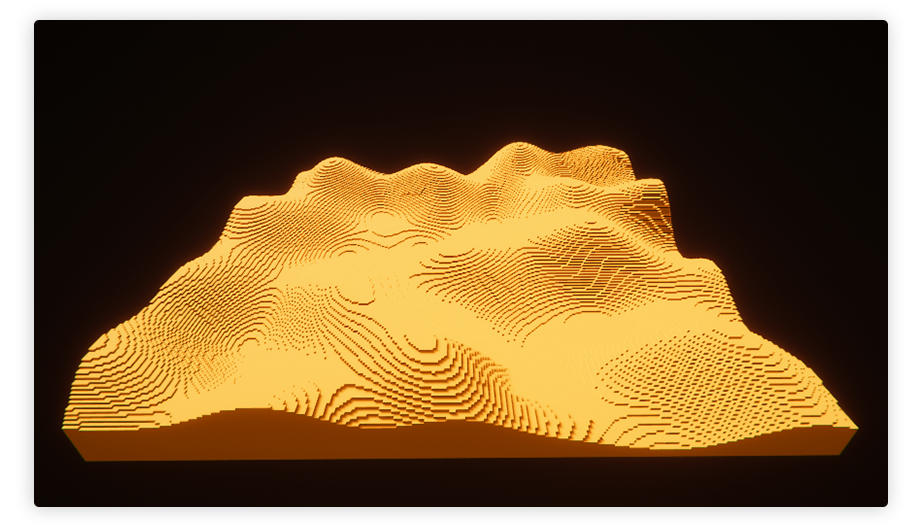
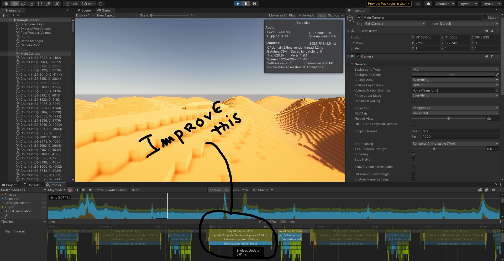

# Minecraft Like




## Description

This is a multi-threaded minecraft-like game created with the Unity game engine. The purpose is to play with low-level issues like chunk creation and rendering optimization, striving for maximum performance.

## Requirements

-   Have `Unity 2020.1.9f1` installed, using for instance Unity Hub. [Get it here](https://unity3d.com/get-unity/download)
-   Have a valid Unity licence
-   Have a unix machine to follow these instructions

## How to use

Clone the repo:

```sh
# From Gitlab
git clone https://gitlab.com/5aitama1/minecraft-like.git

# From Github
git clone https://github.com/5aitama/Unicraft.git

# With GitHub CLI
gh repo clone 5aitama/Unicraft
```

Load the folder `minecraft-like` in Unity or Unity Hub. You're good to go!

## Challenges

- Memory leaks for difficult memory cleaning. We decided to bypass the garbage collector for performance purposes
- Bad performance beyond 1024 chunks per frame

## Todo

Refactor the chunk manager.

## Notes

* ### Improve perfs of Endless system.
    
    Actually Endless system take **~6ms** per frames to know where a chunk need to be Destroy / Create / Keep for  **1024 chunks** (32x32 grid). 
    
    I think we can improve perf with **Unity Job System** maybe.

    